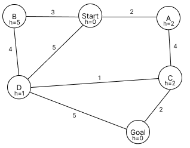
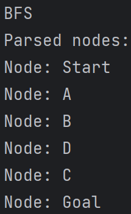
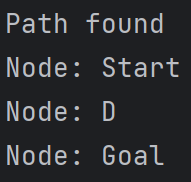
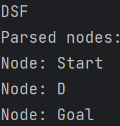
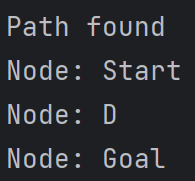

# Uninformed search

Uninformed search, also known as blind search, is a search algorithm that explores a problem space without any specific knowledge or information about the problem other than the initial state and the possible actions to take. 
It lacks domain-specific heuristics or prior knowledge about the problem.
In this repository, we will explore further two uninformed search algorithms : breadth-first search and depth-first search 

## Breadth-First Search (BFS)

The Breadth-First Search is an algorithm that search all nodes of the current depth before moving to the nodes of the next depth.


### Pseudocode

To successfully implement the BFS algorithm, two lists are needed: the fringe which stores the nodes to be explored, and the explored which stores the nodes that have already been explored. 
The fringe works as First In First Out (FIFO): the first element to be stored is the first to be removed from the list. 

//TODO FIFO


The pseudocode is the following:
``` python
BFS(graph, start_node, goal_node):
    fringe = new Queue() # FIFO
    fringe.enqueue(start_node) # Initialize the fringe with the starting node 
    explored = new Set() # Set of explored nodes 
    while fringe is not empty: 
        current_node = fringe.dequeue() # Update the current_node as the first node being added to fringe
        if current_node in explored: continue # If the current_node has already been explored, ignore it
        if current_node == goal_node: return success # If the current node is the goal node, return the success function
        for neighbor in graph.get_neighbors(current_node): # Get all the neighbors of the current node
            fringe.enqueue(neighbor) # Add the neighbor to the fringe queue 
    explored.add(current_node) # Add the current_node to the explored set 
    end
end
```

## Depth-First Search (DFS)

The Depth-First Search is an algorithm that explore the deepest it could before backtracking. When it has explored a node, it then explores the neighbor of this node (which is at a higher depth) first. 
The node at the same depth will be explored if it needs to backtrack, i.e. returning to the previous valid state when it reaches a terminated path. 


### Pseudocode

To successfully implement the DFS algorithm, we need two main list as for the BFS algorithm: the fringe which stores the nodes to be explored, and the explored which stores the nodes that have already been explored. 
The fringe works as Last In First Out (LIFO): the last element to be stored is the first to be removed from the list. 

// TODO : create my own gif to show the lifo mode 


The pseudocode is the following:
``` python
DFS(graph, start_node, goal_node):
    fringe = new Stack() # LIFO
    fringe.push(start_node) # Initialize the fringe with the starting node 
    explored = new Set() # Set of explored nodes 
    while fringe is not empty: 
        current_node = fringe.pop() # Update the current_node as the first node being added to fringe
        if current_node in explored: continue # If the current_node has already been explored, ignore it
        if current_node == goal_node: return success # If the current node is the goal node, return the success function
        for neighbor in graph.get_neighbors(current_node): # Get all the neighbors of the current node
            fringe.push(neighbor) # Add the neighbor to the fringe queue 
    explored.add(current_node) # Add the current_node to the explored set 
    end
end
```

## Example

To test our algorithm, it is useful to run it on an example. 

### Graph 



### Results
#### BFS





#### DFS

The DFS algorithm should perform like this: 


Then the path found should be: 


The results obtain are:





They correspond to what was expected. 